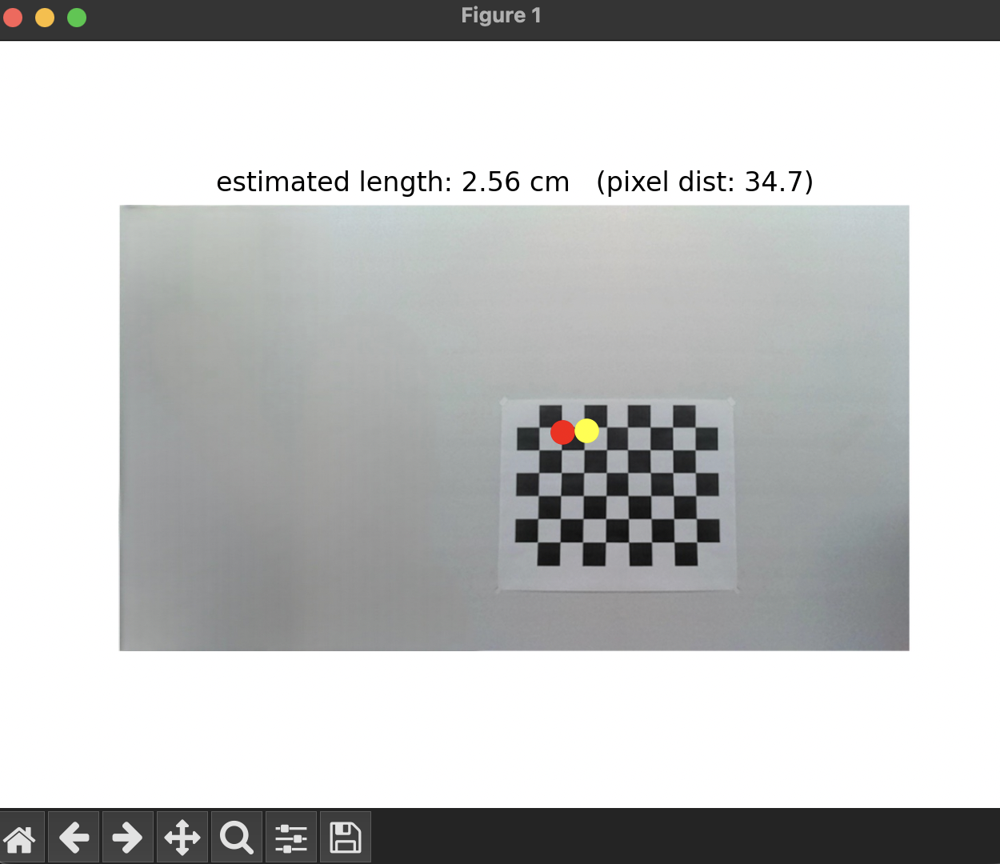

# 📐 CSC 8830 – Homework 1  
### Real-World Dimension Estimation Using Perspective Projection  
**Author:** Amir Sabbaghziarani  
**Course:** CSc 8830 – Computer Vision  
**Instructor:** Dr. Ashwin Ashok  
**Semester:** Spring 2026  

---

## 📝 Overview  
This homework includes two main tasks:

- **(1) Python-based measurement script** that computes the real-world distance between two points on an object using perspective projection equations and known camera intrinsics.

- **(2) A browser-based web application** that replicates the same measurement functionality using image upload and mouse clicks.

Both implementations allow the user to click two points on an object, specify the camera–object distance, and estimate the real-world length.

---

## 🎯 Objectives

### **1. Python Script for Real-World Measurement**
- Loads an image containing a known object or calibration target.  
- Rescales camera intrinsic matrix to match the image size.  
- Allows user to select two pixel points.  
- Back-projects rays into 3D using known depth \( Z_c \).  
- Computes Euclidean distance between the two 3D points.  
- Visualizes and saves the measurement result.

### **2. Web Application**
- Runs in any modern browser and any operating system.  
- Allows image upload.  
- User clicks two points to define a measurement segment.  
- Displays the estimated real-world length based on the same geometric principles.

---

## 📁 Output Example  
A sample output from the Python script is shown below:

**/Output/HW1-1.png**



---

## 🧠 Method Summary

### **Perspective Projection Background**

Given camera intrinsics \( K \) and pixel coordinates \( u \), a back-projected 3D point at depth \( Z_c \) is:

\[
X = Z_c \, K^{-1} u
\]

For two selected pixels \( u_1 \) and \( u_2 \):

\[
X_1 = Z_c K^{-1}u_1, \quad X_2 = Z_c K^{-1}u_2
\]

Estimated real-world distance:

\[
d = \| X_1 - X_2 \|_2
\]

---

## ▶️ Running the Python Script

1. Place your input image (e.g., `ChessBoard.jpeg`) in the working directory.  
2. Run the script:

```bash
python measure_length.py
