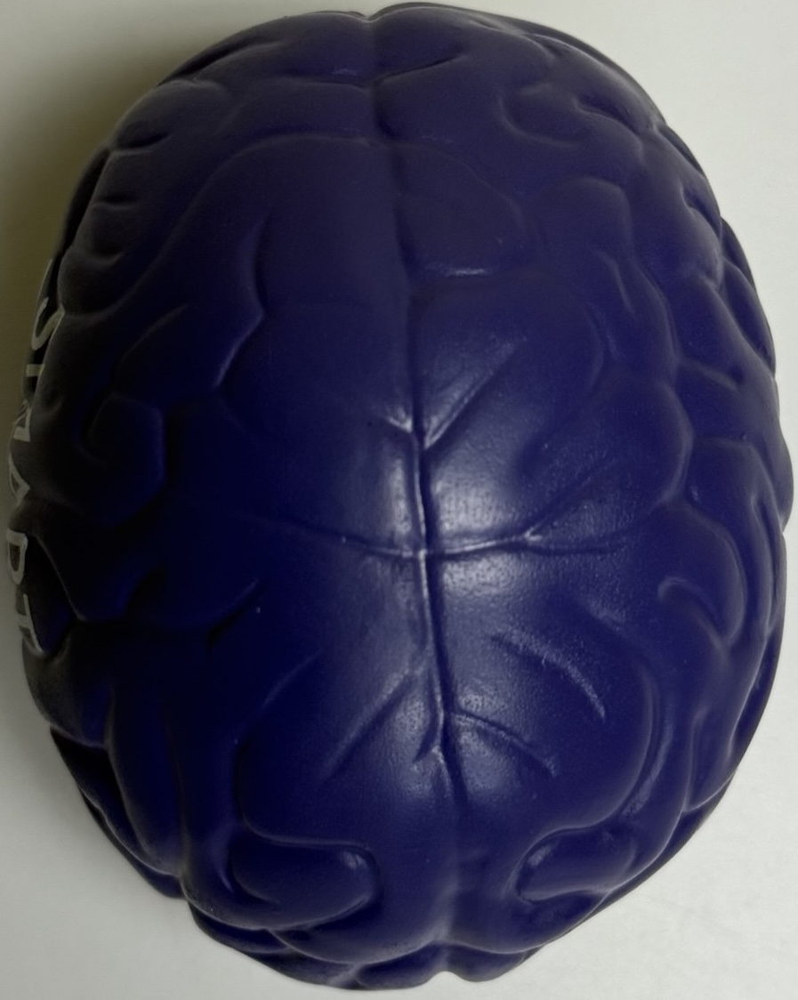
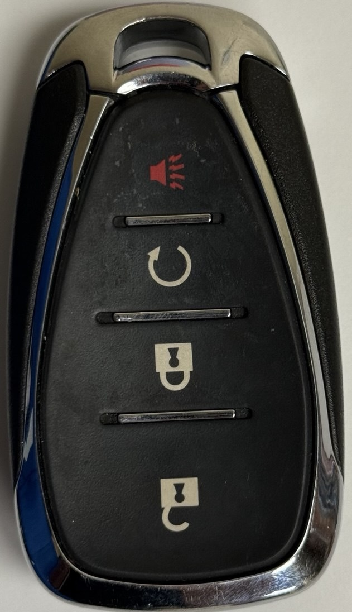
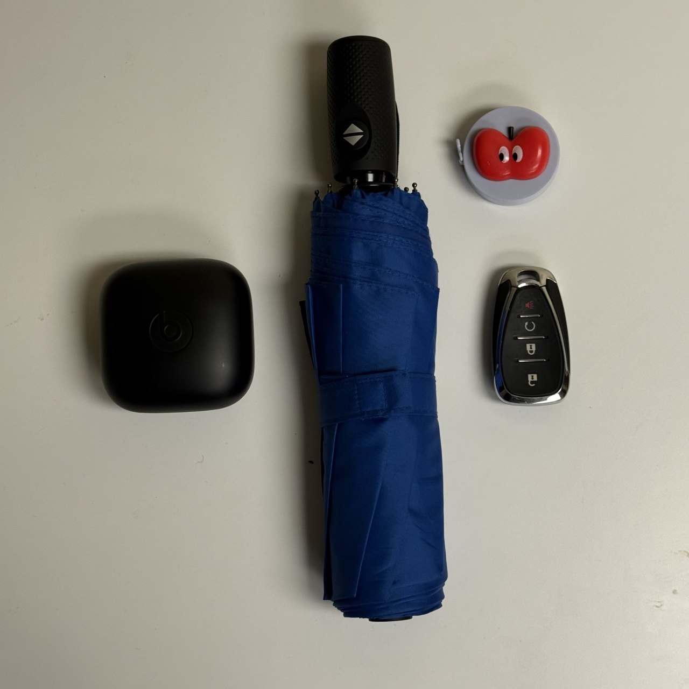
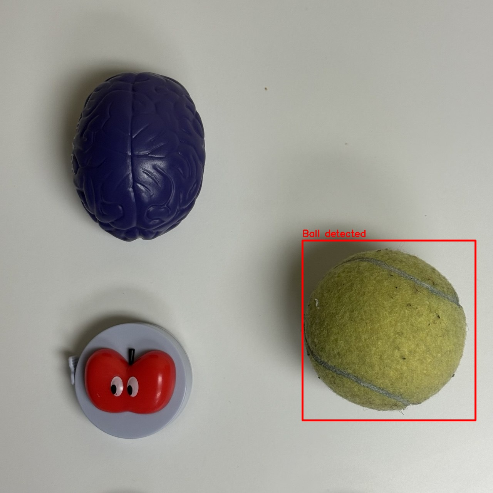
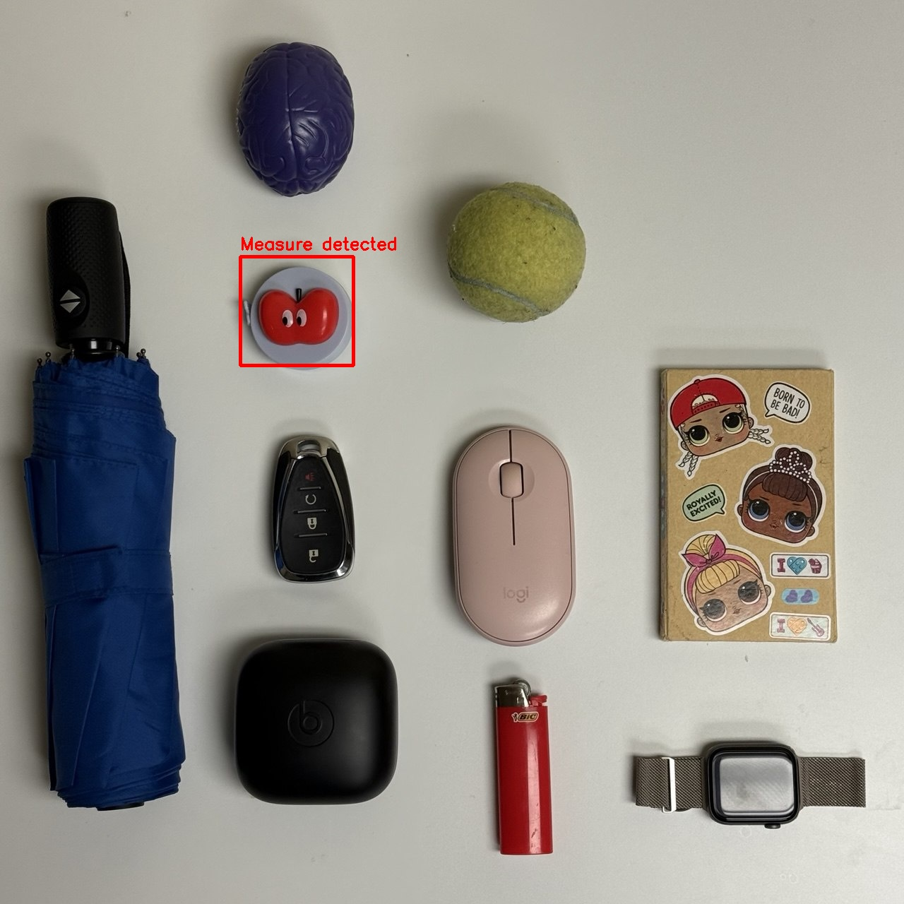
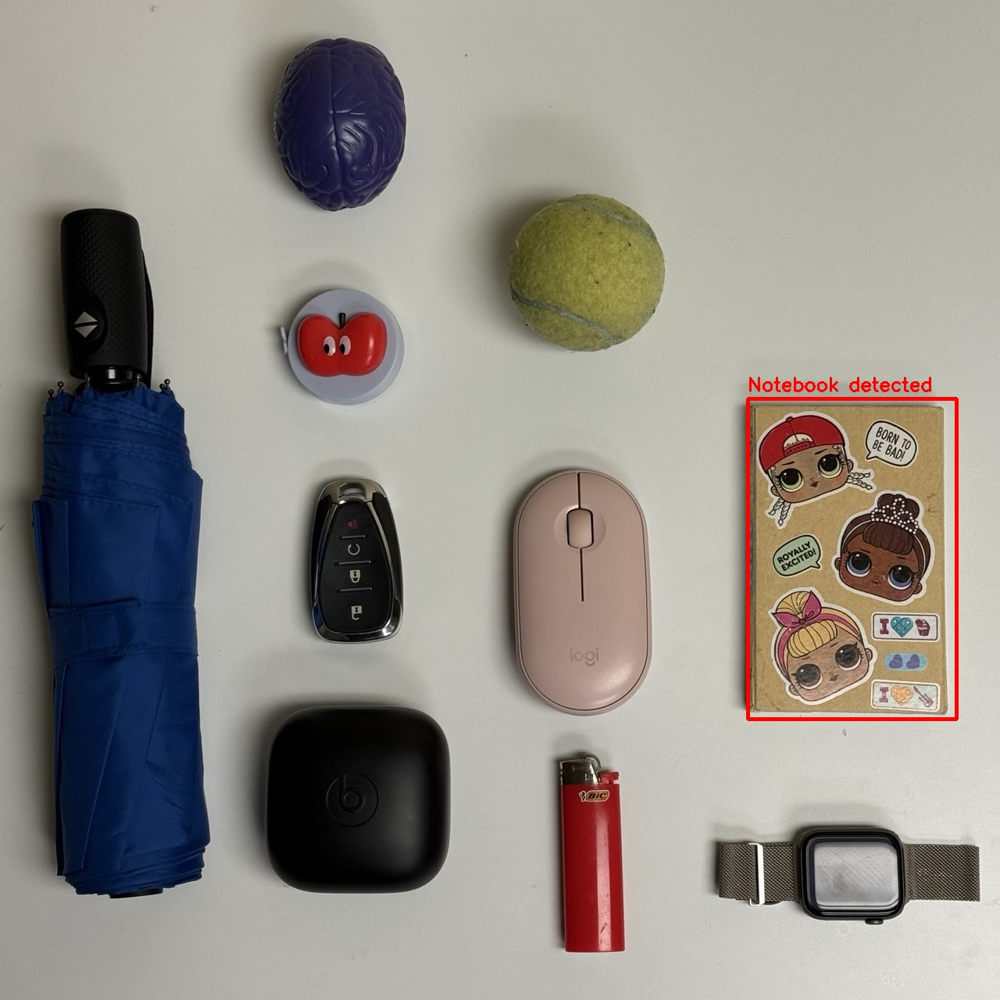

# CSC8830-Computer-Vision Homework 3
## Part 1 — SIFT From Scratch + RANSAC + OpenCV SIFT Comparison

In this part we **implement SIFT feature extraction from scratch** and use it for
feature matching and homography estimation. The pipeline includes:

- Building a Gaussian scale-space and DoG pyramid  
- Detecting keypoints as 3D extrema in the DoG volume  
- Filtering low-contrast and edge-like keypoints  
- Assigning dominant orientations  
- Computing the 128-D SIFT descriptor (4×4 cells × 8 orientation bins)  
- Matching descriptors between template and scene images  
- Applying **RANSAC** to estimate a robust homography and remove outliers  
- **Comparing** the results with the open-source SIFT implementation from OpenCV  

---

### Template Images

Some of the object templates used:

  
  
  
  

---

### Scene Images

Example scene images where objects are detected:

  
  
  
  

---

### Sample Matching & RANSAC Results

Below are some of the matching results (our SIFT + RANSAC vs. OpenCV SIFT / ORB for comparison, depending on the experiment):

  
  
  
  

Each result image visualizes:
- Matched feature points between template and scene  
- Inlier matches after **RANSAC**  
- The estimated homography projected as a polygon around the detected object in the scene  

This allows a direct visual comparison between the **from-scratch SIFT implementation** and the **OpenCV SIFT / ORB baseline** in terms of number of matches, inlier ratio, and stability of the recovered homography.
