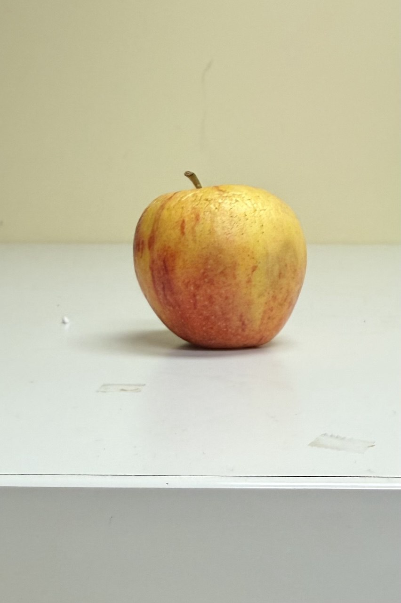
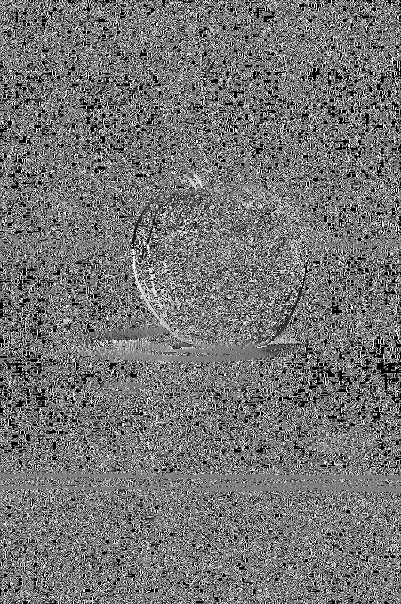
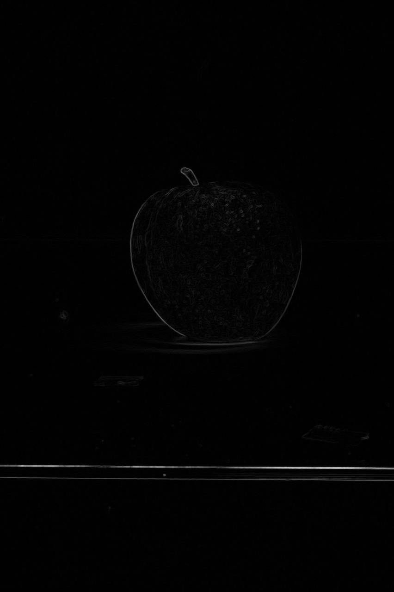
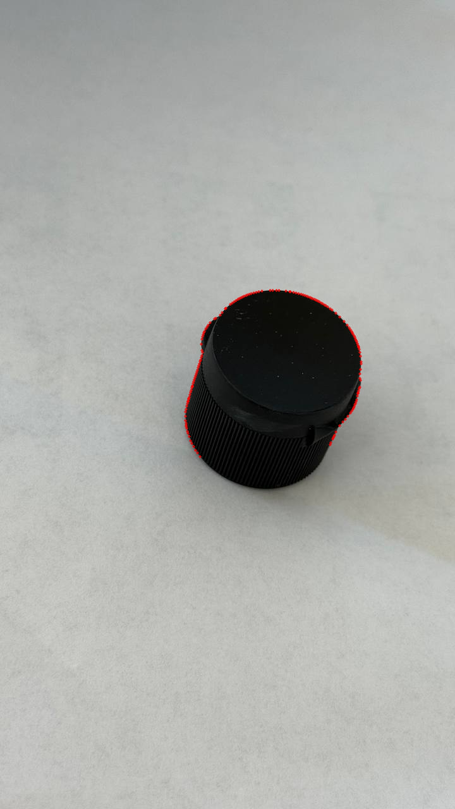
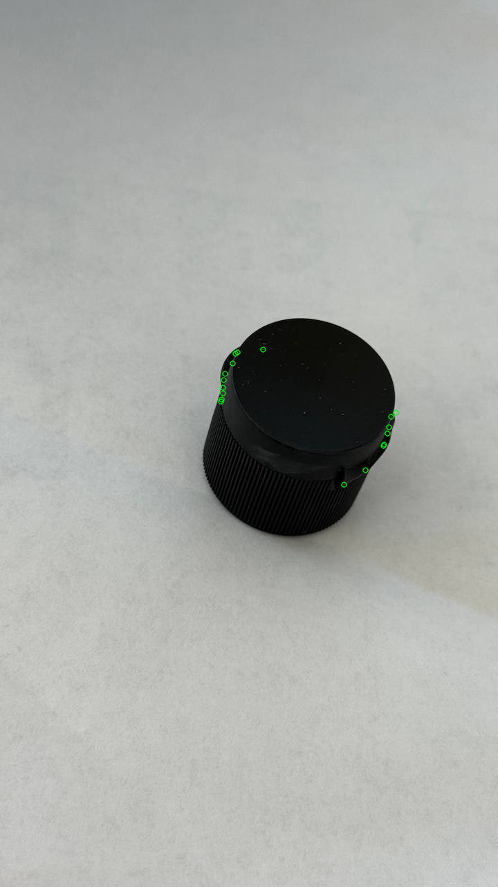

# CSC8830-Computer-Vision Homework 3

# Homework 3 – Part 1  
## Gradient Magnitude, Gradient Angle, and Laplacian of Gaussian (LoG)

### 📌 Task Description
In this part of the assignment, we compute three different image derivatives for every image in the dataset:

- **Gradient Magnitude** using Sobel filters  
- **Gradient Angle** using Sobel filter directions (visualized in degrees)  
- **Laplacian of Gaussian (LoG)** obtained by applying Gaussian smoothing followed by a Laplacian operator  

These outputs highlight edge strength, edge orientation, and second-order intensity changes. Each result is saved as a separate image for visualization.

---

### 📁 Input Example  
A sample input image from the dataset:

---

### 📤 Output Demo  
Below are the generated outputs for the above sample image:

#### 🟦 Gradient Angle  
`part1/output_task1/photo_5839040925936585610_y_grad_ang.png`  

#### 🟩 Gradient Magnitude  
`part1/output_task1/photo_5839040925936585610_y_grad_mag.png`  

#### 🟥 Laplacian of Gaussian (LoG)  
`part1/output_task1/photo_5839040925936585610_y_log.png`  

---

### 🧠 Summary of Method
- Convert image → grayscale  
- Compute Sobel gradients `gx` and `gy`  
- Compute:
  - `magnitude = sqrt(gx² + gy²)`
  - `angle = arctan2(gy, gx)` → mapped to [0°,180°] → normalized  
- Apply Gaussian smoothing  
- Apply Laplacian filter on the smoothed image  
- Normalize all results to 0–255 for visualization  
- Save outputs as PNG files in `output_task1/`

---

### 📂 Output Directory  
All results are saved under:

---

### ✔️ Notes
- The code automatically processes **all images** in the dataset directory.  
- All visualizations are normalized for easy display.  
- Only results (not code) are shown in this README.

---

------------------------
# Homework 3 – Part 2  
## Edge Keypoint Detection & Corner Keypoint Detection

### 📌 Task Description
In this part of the homework, we implement two simple keypoint detectors inspired by the lecture material:

- **EDGE Keypoint Detector**
  - Uses Sobel gradients.
  - Selects pixels with strong gradient magnitude.
  - Applies local non-maximum suppression (3×3 window).

- **CORNER Keypoint Detector**
  - Based on the Harris corner response.
  - Thresholds strong responses.
  - Applies local non-maximum suppression.
  - Limits number of final corners for cleaner visualization.

Both detectors produce keypoints overlaid on the original image and saved for visualization.

---

### 📁 Input Example  

---

### 📤 Output Demo  

#### 🟥 EDGE Keypoints  
`part2/output_part2/photo_5850306766887914525_y_edge_kp.png`  

#### 🟩 CORNER Keypoints  
`part2/output_part2/photo_5850306766887914525_y_corner_kp.png`  

---

### 🧠 Method Summary

#### **EDGE Keypoints**
- Smooth image with Gaussian blur  
- Compute Sobel gradients `gx` and `gy`  
- Compute magnitude `M = sqrt(gx² + gy²)`  
- Keep pixels above a threshold  
- Apply 3×3 local maxima filter  
- Mark surviving pixels as edge keypoints (red)

#### **CORNER Keypoints**
- Smooth image using heavy Gaussian blur  
- Compute Harris response `R(x, y)`  
- Threshold `R > τ * max(R)`  
- Apply 3×3 local maxima filter  
- Keep strongest set of corners (green)

---

### 📂 Output Directory  

All results are saved in:

---

### ✔️ Notes
- Keypoints are drawn using `cv2.drawKeypoints()` for clear visualization.  
- Only output visualizations are shown in the README; code is not included.  
- Parameters (blur size, thresholds, Harris constants, max keypoints) can be tuned to adjust detector sensitivity.  

