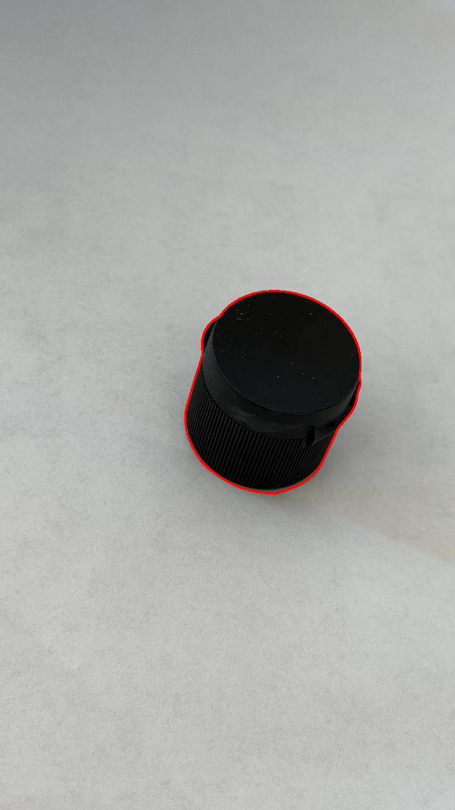
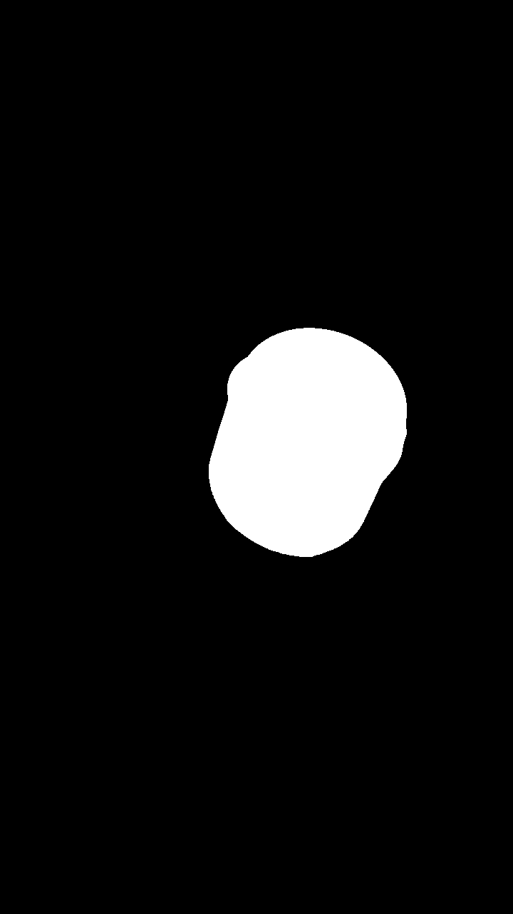
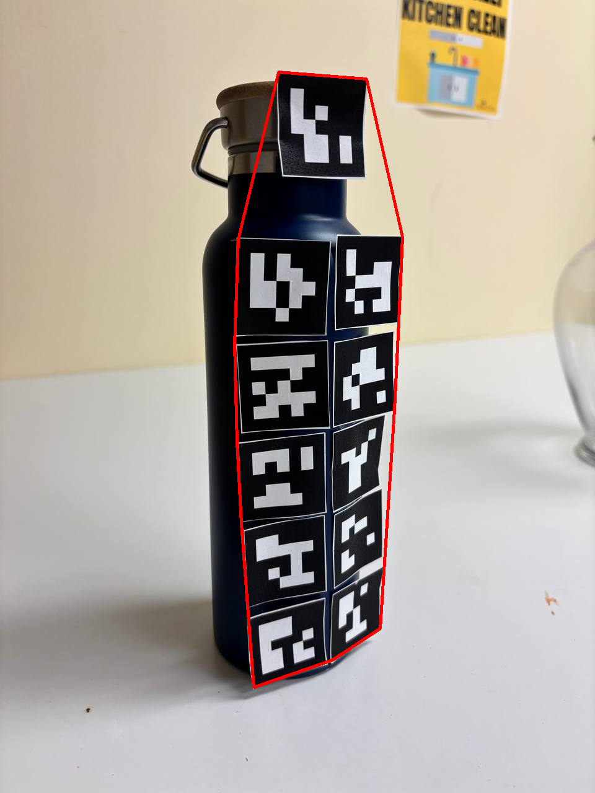
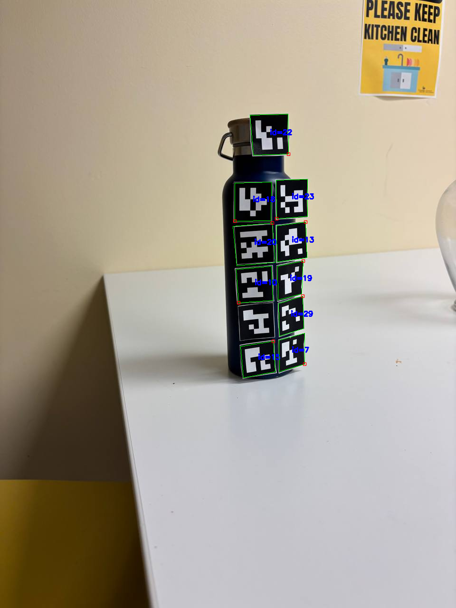
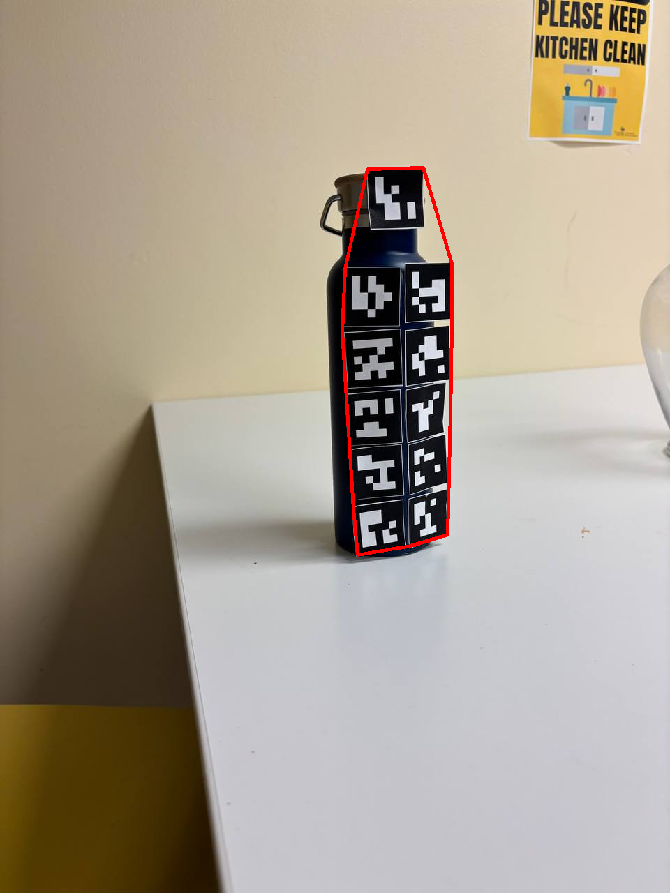
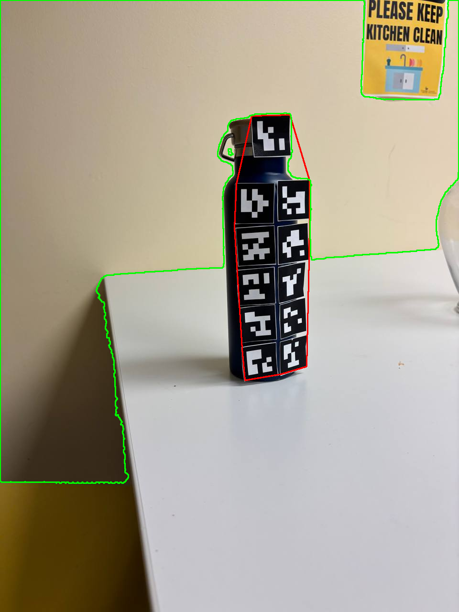

# CSC8830-Computer-Vision Homework 3

# Homework 3 – Part 1  
## Gradient Magnitude, Gradient Angle, and Laplacian of Gaussian (LoG)

### 📌 Task Description
In this part of the assignment, we compute three different image derivatives for every image in the dataset:

- **Gradient Magnitude** using Sobel filters  
- **Gradient Angle** using Sobel filter directions (visualized in degrees)  
- **Laplacian of Gaussian (LoG)** obtained by applying Gaussian smoothing followed by a Laplacian operator  

These outputs highlight edge strength, edge orientation, and second-order intensity changes. Each result is saved as a separate image for visualization.

---

### 📁 Input Example  
A sample input image from the dataset:

---

### 📤 Output Demo  
Below are the generated outputs for the above sample image:

#### 🟦 Gradient Angle  
`part1/output_task1/photo_5839040925936585610_y_grad_ang.png`  

#### 🟩 Gradient Magnitude  
`part1/output_task1/photo_5839040925936585610_y_grad_mag.png`  

#### 🟥 Laplacian of Gaussian (LoG)  
`part1/output_task1/photo_5839040925936585610_y_log.png`  

---

### 🧠 Summary of Method
- Convert image → grayscale  
- Compute Sobel gradients `gx` and `gy`  
- Compute:
  - `magnitude = sqrt(gx² + gy²)`
  - `angle = arctan2(gy, gx)` → mapped to [0°,180°] → normalized  
- Apply Gaussian smoothing  
- Apply Laplacian filter on the smoothed image  
- Normalize all results to 0–255 for visualization  
- Save outputs as PNG files in `output_task1/`

---

### 📂 Output Directory  
All results are saved under:

---

### ✔️ Notes
- The code automatically processes **all images** in the dataset directory.  
- All visualizations are normalized for easy display.  
- Only results (not code) are shown in this README.

---

------------------------
# Homework 3 – Part 2  
## Edge Keypoint Detection & Corner Keypoint Detection

### 📌 Task Description
In this part of the homework, we implement two simple keypoint detectors inspired by the lecture material:

- **EDGE Keypoint Detector**
  - Uses Sobel gradients.
  - Selects pixels with strong gradient magnitude.
  - Applies local non-maximum suppression (3×3 window).

- **CORNER Keypoint Detector**
  - Based on the Harris corner response.
  - Thresholds strong responses.
  - Applies local non-maximum suppression.
  - Limits number of final corners for cleaner visualization.

Both detectors produce keypoints overlaid on the original image and saved for visualization.

---

### 📁 Input Example  

---

### 📤 Output Demo  

#### 🟥 EDGE Keypoints  
`part2/output_part2/photo_5850306766887914525_y_edge_kp.png`  

#### 🟩 CORNER Keypoints  
`part2/output_part2/photo_5850306766887914525_y_corner_kp.png`  

---

### 🧠 Method Summary

#### **EDGE Keypoints**
- Smooth image with Gaussian blur  
- Compute Sobel gradients `gx` and `gy`  
- Compute magnitude `M = sqrt(gx² + gy²)`  
- Keep pixels above a threshold  
- Apply 3×3 local maxima filter  
- Mark surviving pixels as edge keypoints (red)

#### **CORNER Keypoints**
- Smooth image using heavy Gaussian blur  
- Compute Harris response `R(x, y)`  
- Threshold `R > τ * max(R)`  
- Apply 3×3 local maxima filter  
- Keep strongest set of corners (green)

---

### 📂 Output Directory  

All results are saved in:

---

### ✔️ Notes
- Keypoints are drawn using `cv2.drawKeypoints()` for clear visualization.  
- Only output visualizations are shown in the README; code is not included.  
- Parameters (blur size, thresholds, Harris constants, max keypoints) can be tuned to adjust detector sensitivity.  

---------------
# Homework 3 – Computer Vision Tasks  
This project includes three classical image-processing tasks implemented using OpenCV:  
1) Gradient magnitude, gradient angle, and Laplacian of Gaussian  
2) Edge and corner keypoint detection  
3) Object boundary extraction (no machine learning allowed)

---

# Part 1 – Gradient Magnitude, Gradient Angle & Laplacian of Gaussian (LoG)

### Task Summary
For each image in the dataset, we compute:
- Gradient Magnitude (Sobel-based)
- Gradient Angle (visualized by mapping angles to 0–180 degrees)
- Laplacian of Gaussian (Gaussian smoothing + Laplacian filtering)

All outputs are normalized to 0–255 for visualization and saved.

### Input Example

### Output Demo

**Gradient Angle**  
`part1/output_task1/photo_5839040925936585610_y_grad_ang.png`  

**Gradient Magnitude**  
`part1/output_task1/photo_5839040925936585610_y_grad_mag.png`  

**Laplacian of Gaussian (LoG)**  
`part1/output_task1/photo_5839040925936585610_y_log.png`  

---

# Part 2 – Edge & Corner Keypoint Detection

### Task Summary
Based on methods taught in lecture:

**Edge Keypoints**
- Gaussian smoothing  
- Sobel gradients  
- Gradient magnitude thresholding  
- Local maxima detection (3×3 non-max suppression)  
- Visualized in **red**

**Corner Keypoints**
- Heavier Gaussian smoothing  
- Harris corner response  
- Thresholding  
- Local maxima detection  
- Top corners kept for visualization  
- Visualized in **green**

### Input Example

### Output Demo

**EDGE Keypoints**  
`part2/output_part2/photo_5850306766887914525_y_edge_kp.png`  

**CORNER Keypoints**  
`part2/output_part2/photo_5850306766887914525_y_corner_kp.png`  

---

# Part 3 – Object Boundary Extraction (No ML / DL Allowed)

### Task Summary
A classical image-processing pipeline is used to extract the object boundary:

1. Convert to grayscale and blur (noise reduction)  
2. Apply Otsu threshold to separate foreground/background  
3. Perform morphological closing + opening to clean and smooth the mask  
4. Find contours and choose the **largest contour** as the object  
5. Create:
   - A binary mask of the object  
   - An overlay image with the boundary drawn in **red**

### Input Example

### Output Demo

**Object Boundary Overlay**  
`part3/output_part3/photo_5850306766887914525_y_boundary.png`  

**Binary Mask**  
`part3/output_part3/photo_5850306766887914525_y_mask.png`  

---

# Notes
- All tasks rely solely on classical image processing; no deep learning or machine learning methods were used.  
- The repository includes only the results and explanations; source code is shown separately for reference and is not included in this README.

# Part 4 – Object Segmentation of a Non-Rectangular Object Using ArUco Markers

### Task Summary
In this final part, we segment a **non-rectangular object** by placing **ArUco markers along its physical boundary** and capturing multiple images from various angles and distances.  
The segmentation uses **only classical computer vision** (OpenCV), no machine learning or deep learning.

### Method Overview
1. Convert image to grayscale and apply light smoothing  
2. Detect ArUco markers using OpenCV (trying multiple dictionaries automatically)  
3. Gather all detected marker corner points  
4. Compute a **convex hull** over all marker points → this forms the object boundary  
5. Generate:
   - An image with detected markers drawn  
   - A binary object mask  
   - An overlay showing the red boundary  
   - A visualization of marker sizes (px), estimated from their corner geometry  

### Input Example  

**Input Image**  

---

### Output Demo  

**Detected ArUco Markers**  
`part4/output/4972212806438554464_markers.png`  

**Binary Mask of Segmented Object**  
`part4/output/4972212806438554464_mask.png`  

**Object Boundary Overlay (Red Hull)**  
`part4/output/4972212806438554464_boundary.png`  

**Object Boundary + Marker Size Estimates**  
`part4/output/4972212806438554464_size.png`  

---

### Notes
- Uses OpenCV’s built-in ArUco detection (supports both classic ArUco and AprilTag dictionaries depending on your OpenCV build).  
- Automatically selects the dictionary that detects the **largest number of markers**.  
- Convex hull segmentation provides a clean, robust boundary even when images are captured from different angles.  
- No deep learning or machine learning methods were used.

----------------------------------
# Part 5 – Comparison of ArUco-Based Segmentation vs. SAM2 Segmentation

### Task Summary
In this final experiment, we compare the **classical ArUco-marker-based segmentation** from Part 4 with a **modern foundation model**, **SAM2** (Segment Anything Model v2).  
The purpose of this comparison is to evaluate:

- How accurately SAM2 can segment a non-rectangular object without markers  
- How reliable ArUco-based geometric segmentation is when markers lie exactly on the boundary  
- How the two masks differ in terms of boundary precision and coverage

### Comparison Approach
1. Use **ArUco-based segmentation** from Part 4 to produce:
   - Marker visualization
   - Binary mask
   - Red boundary overlay
   - Size estimation of markers

2. Run the **SAM2 model** on the same image to generate an automatic segmentation mask.

3. Create a **comparison overlay** to visualize differences:
   - White/green region → overlap  
   - Red region → SAM2 over-segmentation  
   - Blue region → SAM2 under-segmentation  
   (depending on your visualization configuration)

### Input Example

*(SAM2 is run on the same input used for ArUco segmentation)*

---

### Output Demo

**Detected ArUco Markers**  
`part5/output_aruco_seg_2/4972212806438554467_markers.png`  

**ArUco Binary Mask**  
`part5/output_aruco_seg_2/4972212806438554467_mask_aruco.png`  

**SAM2 Segmentation Mask**  
`part5/output_aruco_seg_2/4972212806438554467_mask_sam2.png`  

**ArUco Boundary Overlay (Red Hull)**  
`part5/output_aruco_seg_2/4972212806438554467_boundary_aruco.png`  

**ArUco Boundary + Marker Size Visualization**  
`part5/output_aruco_seg_2/4972212806438554467_size_aruco.png`  

**ArUco vs SAM2 Comparison Overlay**  
`part5/output_aruco_seg_2/4972212806438554467_compare_overlay.png`  

---

### Observations (General Guidelines You Can Add to Your Report)
- ArUco-based segmentation tends to produce **very precise geometric boundaries**, especially when markers are placed exactly on the object perimeter.  
- SAM2 may **over-segment** or **under-segment** depending on texture, lighting, and background clutter.  
- SAM2 is fully automatic, while ArUco segmentation requires marker placement but provides a more controlled result.  
- The comparison overlay visually highlights **regions of discrepancy**, helping evaluate segmentation quality.

