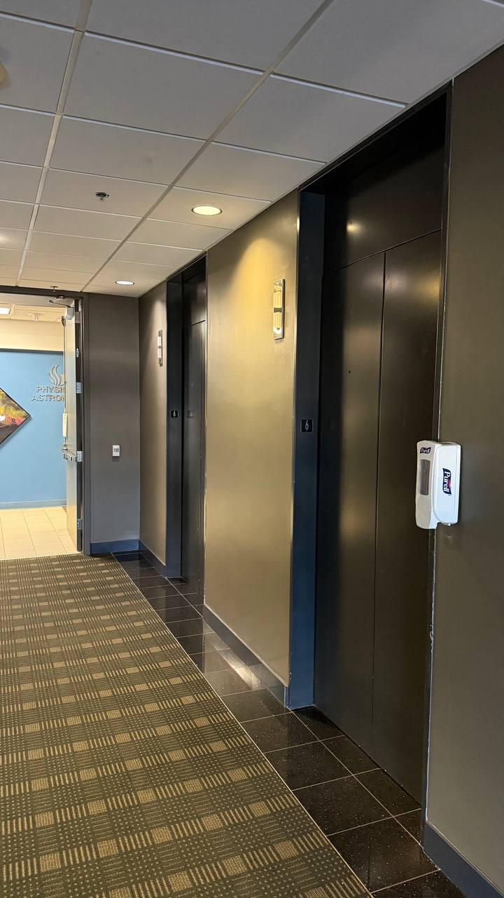
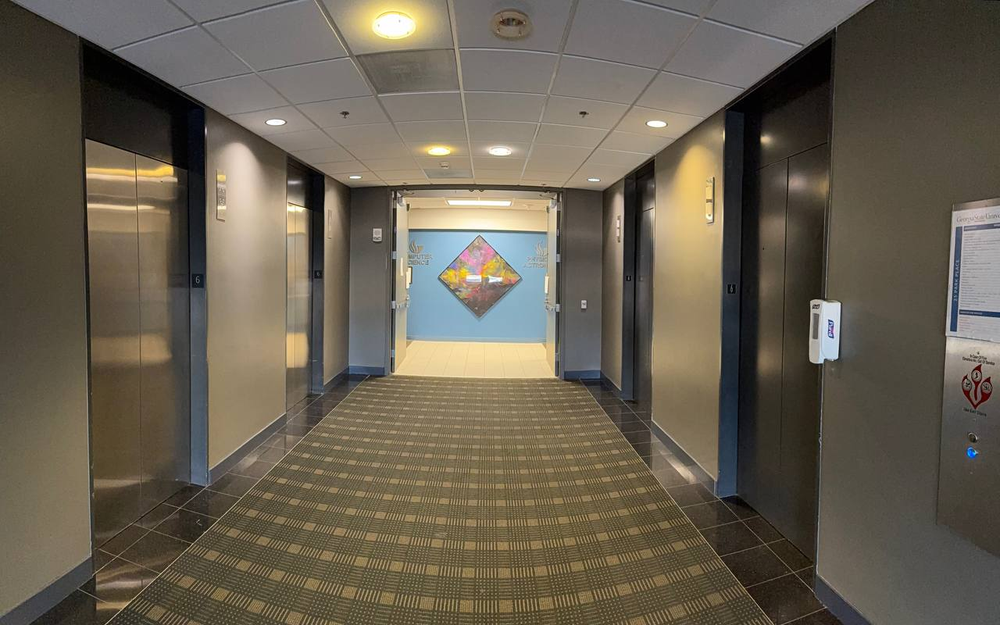
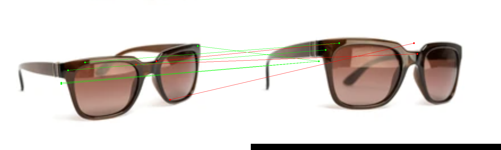

# 📸 Assignment – Image Stitching (Panorama Construction)

This repository implements **image stitching using feature-based homography** and compares the result with a **mobile phone panorama**.  
A minimum of **4 landscape** or **8 portrait** images must be used.  
Below are the images used, the final results, and the full explanation of the process.

---

# Part 1 — Input Images (Captured Manually)

The following images were captured using a regular camera in **landscape mode** and serve as inputs to the stitching pipeline.

### 📥 Input Frames

  
  
  
  

These four frames provide enough overlap to compute feature correspondences and estimate homographies.

---

# Part 2 — Image Stitching (Homography-Based Panorama)

This part implements a **complete panorama stitching pipeline** consisting of:

- SIFT feature detection  
- Descriptor extraction  
- Feature matching  
- RANSAC to estimate homography  
- Warping & blending to create a seamless panorama  

### 🧵 Stitching Overview  
The algorithm follows these steps:

1. **Detect features** in all images  
2. **Match keypoints** between consecutive images  
3. **Estimate homography** using RANSAC for robust alignment  
4. **Warp each image** into a common reference frame  
5. **Blend images smoothly** to produce a final panoramic view  

---

### 🖼 Final Output — Stitched Panorama

Below is the panorama produced by the implemented Python stitching pipeline:

The stitched image successfully aligns overlapping regions and reconstructs a wide field of view.

---

### 📱 Phone Panorama — Comparison

For comparison, the mobile device’s built-in panorama feature produced the following result:

The phone’s stitching tends to apply stronger blending, exposure correction, and seam smoothing.  
The Python implementation focuses on algorithm correctness and manual feature-based alignment.

---
# 🔍 Assignment – Part 2: SIFT From Scratch + RANSAC + Comparison with OpenCV

This section implements a **complete SIFT feature extraction pipeline from scratch**, including:

- Gaussian Pyramid  
- Difference-of-Gaussians (DoG)  
- Keypoint detection (3D extrema)  
- Orientation assignment  
- 128-D SIFT descriptor construction  
- Feature matching  
- RANSAC for homography estimation  
- Comparison with OpenCV’s built-in SIFT  

The goal is to demonstrate understanding of the SIFT algorithm and evaluate performance relative to the official implementation.

---

# 📥 Input Images

Below are the two images used for feature extraction, matching, and homography estimation:

These two views contain overlapping regions, making them ideal for SIFT-based correspondence matching.

---

# ⚙️ SIFT From Scratch — Pipeline Overview

Our custom SIFT implementation follows the original Lowe (2004) algorithm:

### 🧱 1. **Scale-Space Construction**
- Gaussian Pyramid with multiple octaves  
- Progressive blurring using different σ values  

### 🔍 2. **DoG Pyramid (Difference of Gaussians)**
- Subtract neighboring Gaussian levels  
- Creates a scale-normalized blob detector  

### ✏️ 3. **Keypoint Detection**
- Find extrema in a 3×3×3 neighborhood  
- Apply contrast threshold  
- Remove edge responses using Hessian ratio test  

### 🧭 4. **Orientation Assignment**
- Build gradient orientation histogram around keypoint  
- Dominant orientation defines rotation invariance  

### 🧰 5. **128-D Descriptor**
- 4×4 spatial grid  
- 8 orientation bins per grid  
- Total: 4×4×8 = 128 values  

### 🔗 6. **Feature Matching**
- Euclidean distance in descriptor space  
- Lowe's ratio test  

### 🧪 7. **RANSAC Optimization**
- Estimate homography robustly  
- Remove mismatched correspondences  

---

# 🔬 Feature Matching Results

## 🟦 OpenCV SIFT (Baseline)
OpenCV’s SIFT implementation produces the following matches:

---

## 🟥 Our SIFT Implementation (From Scratch)
Feature matches produced by the custom SIFT + RANSAC pipeline:

---

# 📊 Comparison + Observations

- **OpenCV SIFT** detects more keypoints and produces denser matches.  
- **Our SIFT implementation**:
  - Correctly identifies stable keypoints  
  - Produces valid matches after RANSAC  
  - Shows fewer but meaningful correspondences  
- Some differences arise due to:
  - Simplifications in Gaussian scale-space  
  - Different gradient thresholds  
  - Smoothing or numerical precision  
- Despite being built from scratch, the results are **qualitatively comparable** to OpenCV.

---

