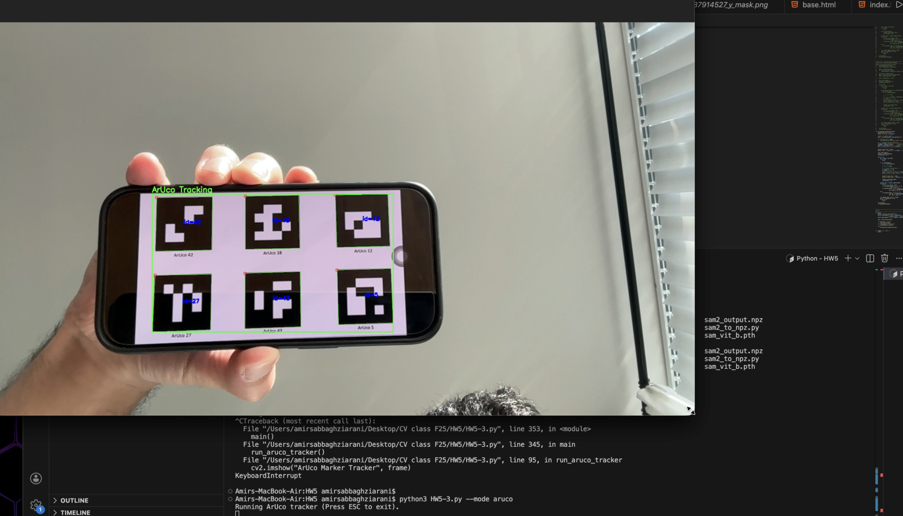
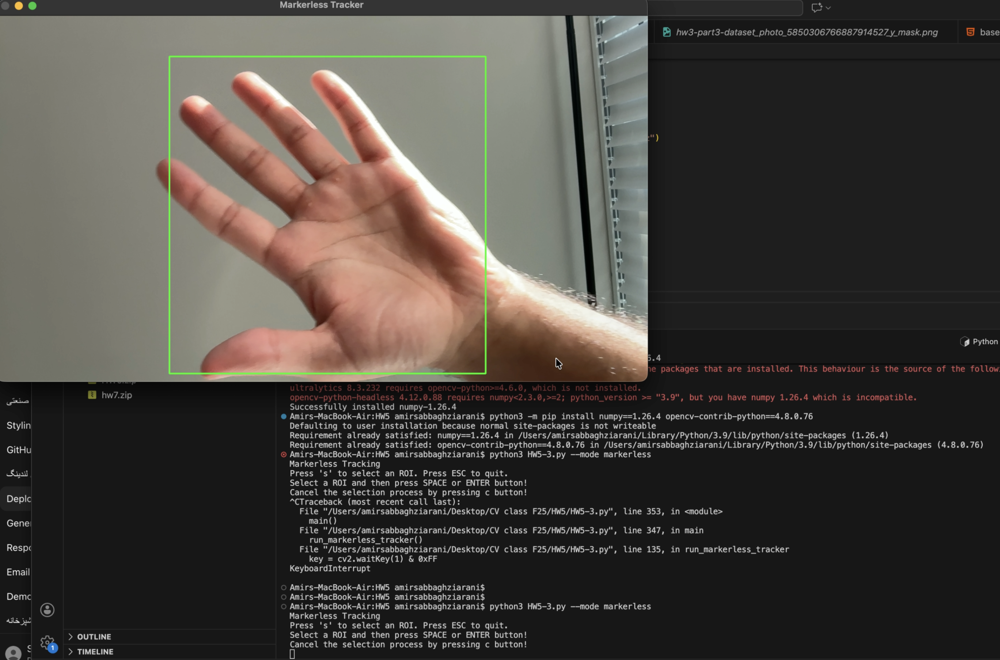
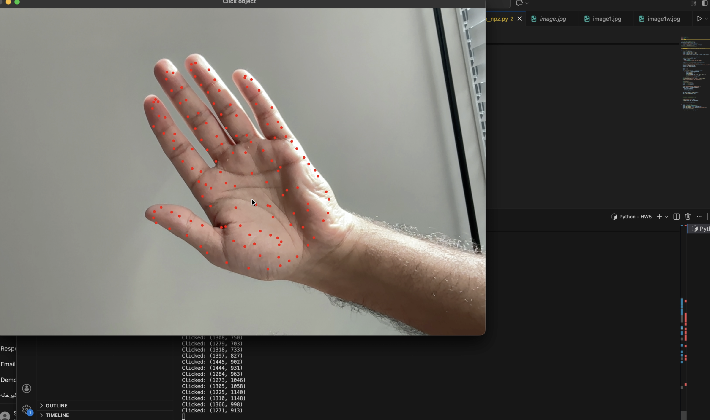
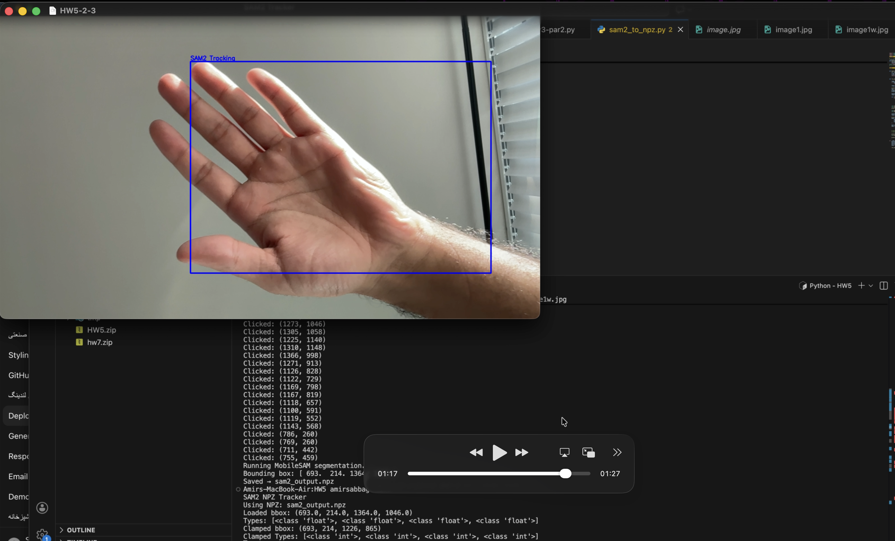

# CSC8830-Computer-Vision Homework 5
# Homework 5 – Real-Time Object Tracking  
This homework implements three real-time object tracking methods using OpenCV:

- **(i) Marker-Based Tracking (ArUco)**
- **(ii) Markerless Tracking (ROI + CSRT)**
- **(iii) SAM2-Based Tracking Using NPZ Initialization**

All three modes use the same camera pipeline and CSRT tracker backend.  
Below are descriptions and demo images for each method.

---

## (i) Marker-Based Tracking (ArUco)

This mode performs real-time tracking using **ArUco markers** placed on the object.  
The script detects markers frame-by-frame and builds a tight bounding box around them.

### Demo – ArUco Marker Tracking  
`demo-aruco.png`  

### Demo – Marker Tracking  
`demo-aruco.png`  

### Demo – SAM2 Tracking  
`demo-aruco.png`  

