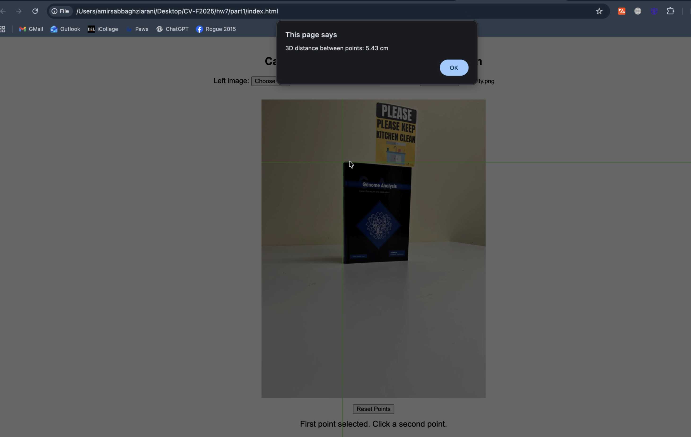
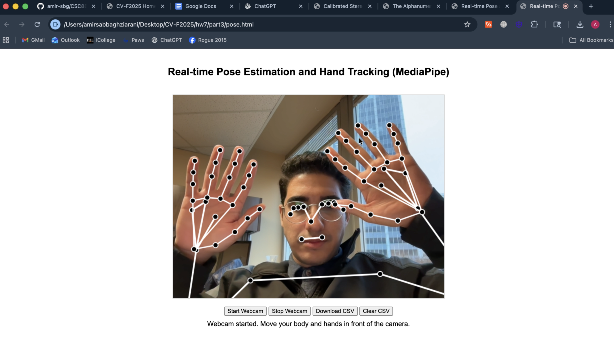

# ComputerVision-csc8830-HW7
# Homework 7 – Calibrated Stereo Size Estimation + Real-Time Pose & Hand Tracking

This assignment extends previous 3D reconstruction work by implementing two major components:

1. **Object-Size Estimation Using CALIBRATED Stereo Cameras**  
2. **Real-Time Pose Estimation & Hand Tracking (OpenPose / MediaPipe)**  

Below is the documentation along with demo screenshots.

---

# 1. Object Size Estimation Using CALIBRATED Stereo

This task reimplements the object-size estimation pipeline from Assignment 1, but now using **calibrated stereo geometry**.  
Since the stereo system is calibrated, the depth of any visible point can be computed precisely:

\[
Z = \frac{f \cdot B}{d}
\]

Where:  
- \( f \) = focal length of the camera  
- \( B \) = baseline (distance between left & right cameras)  
- \( d \) = disparity between matched points in left/right images  

Once **Z (depth)** is known, the object’s **real-world size** can be computed by back-projecting pixels into 3D camera coordinates.

### Shapes Supported  
- **Rectangular Objects** → estimate **width × height**  
- **Circular Objects** → estimate **diameter**  
- **Arbitrary Polygons** → estimate **all visible edge lengths**

### Demo Screenshot  
`HW7-1_SS.png`  

The screenshot shows:  
- Detected object edges  
- Stereo-correspondence matches  
- Computed 3D distances displayed on screen  

---

# 2. Real-Time Pose Estimation & Hand Tracking  
This part implements real-time **pose tracking** using either:  
- **MediaPipe Pose + Hand Models**, or  
- **OpenPose Body + Hand Keypoints**

### Requirements Fulfilled  
✔ Must show pose skeleton in real time  
✔ Must save pose data into a **CSV file**  
✔ Must visually display model output  
✔ No classification is required — only keypoint detection  

### What the CSV Contains
Each row contains tracked keypoints for a single video frame:

Where:  
- `x, y` = normalized or pixel coordinates  
- `conf` = detection confidence  
- Missing points are encoded as `-1` or `0` depending on the library  

This format allows further processing such as gesture analysis, biomechanics, or temporal pose modeling.

### Demo Screenshot  
`HW7-3_SS.png`  

The screenshot shows:  
- Real-time pose skeleton drawing  
- Hand landmarks  
- On-screen visualization identical to what is stored in CSV  

---

# Summary

| Component | Description | Output |
|----------|-------------|--------|
| **Stereo Size Estimation** | Computes 3D sizes using calibrated stereo + disparity | Screenshot `HW7-1_SS.png` |
| **Pose Estimation & Hand Tracking** | MediaPipe/OpenPose skeleton + hand tracking in real time | Screenshot `HW7-3_SS.png`, CSV landmark file |

Both implementations run live, display visual overlays, and export numerical tracking data.

